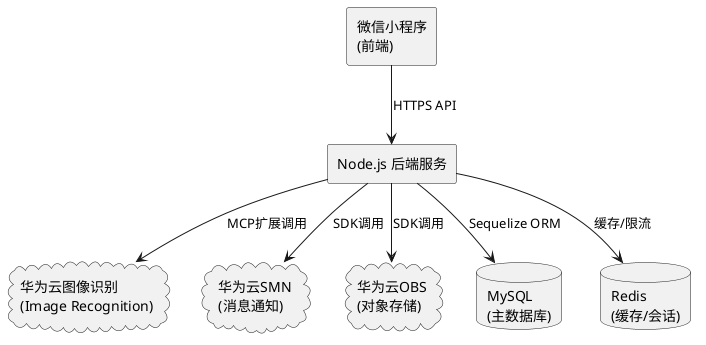

# **1. 实现模型**

## **1.1 上下文视图**



## **1.2 服务/组件总体架构**

```
┌─────────────────────────────────────────────────────┐
│                   微信小程序前端                       │
│  ┌──────┐ ┌──────┐ ┌──────┐ ┌──────┐ ┌──────┐      │
│  │ 首页 │ │ 上报 │ │ 搜索 │ │ 认领 │ │ 我的 │      │
│  └──────┘ └──────┘ └──────┘ └──────┘ └──────┘      │
└──────────────────────┬──────────────────────────────┘
                       │ HTTPS
┌──────────────────────┴──────────────────────────────┐
│                  Express 后端服务                      │
│  ┌──────────────────────────────────────────────┐   │
│  │              路由层 (Routes)                    │   │
│  │  /api/items  /api/search  /api/claims  /api/auth │   │
│  └──────────────────────┬───────────────────────┘   │
│  ┌──────────────────────┴───────────────────────┐   │
│  │            控制器层 (Controllers)               │   │
│  └──────────────────────┬───────────────────────┘   │
│  ┌──────────────────────┴───────────────────────┐   │
│  │             服务层 (Services)                   │   │
│  │  ┌────────┐ ┌────────┐ ┌────────┐ ┌───────┐ │   │
│  │  │匹配算法│ │图像识别│ │消息推送│ │加解密 │ │   │
│  │  └────────┘ └────────┘ └────────┘ └───────┘ │   │
│  └──────────────────────┬───────────────────────┘   │
│  ┌──────────────────────┴───────────────────────┐   │
│  │            数据层 (Models/Sequelize)            │   │
│  └──────────────────────────────────────────────┘   │
└─────────────────────────────────────────────────────┘
```

## **1.3 实现设计文档**

### **1.3.1 后端技术选型**

| 层次 | 技术 | 说明 |
|------|------|------|
| Web框架 | Express.js | 轻量级、生态丰富 |
| ORM | Sequelize | MySQL ORM，支持迁移 |
| 认证 | JWT (jsonwebtoken) | 无状态Token认证 |
| 文件上传 | Multer | multipart/form-data处理 |
| 加密 | crypto (AES-256-CBC) | 联系方式加密 |
| 定时任务 | node-schedule | 过期物品自动标记 |
| 限流 | Redis + 自定义中间件 | 风控与防刷 |

### **1.3.2 前端技术选型**

| 层次 | 技术 | 说明 |
|------|------|------|
| 框架 | 微信小程序原生 | 无需第三方框架，轻量 |
| UI组件 | WeUI | 微信官方设计规范 |
| 状态管理 | 小程序globalData + 缓存 | 简单场景无需引入复杂状态管理 |
| 网络请求 | wx.request封装 | 统一拦截、Token注入 |

### **1.3.3 MCP扩展设计（图像识别）**

```json
{
  "mcpServers": {
    "huawei-image-recognition": {
      "command": "node",
      "args": ["src/mcp/image-recognition-server.js"],
      "env": {
        "HW_CLOUD_AK": "${HW_CLOUD_AK}",
        "HW_CLOUD_SK": "${HW_CLOUD_SK}",
        "HW_CLOUD_REGION": "cn-north-4"
      }
    }
  }
}
```

MCP Server提供工具：
- `recognize_item`: 接收图片Base64，调用华为云图像识别，返回类别标签+置信度
- `get_categories`: 获取支持的物品分类列表

# **2. 接口设计**

## **2.1 总体设计**

- 基础路径：`/api/v1`
- 认证方式：Bearer Token (JWT)
- 响应格式：`{ code: number, message: string, data: any }`
- 错误码规范：4位数字，前2位为模块编号（10=认证, 20=物品, 30=搜索, 40=认领）

## **2.2 接口清单**

### **认证模块**

| 方法 | 路径 | 说明 |
|------|------|------|
| POST | /api/v1/auth/login | 微信登录（code换Token） |
| GET | /api/v1/auth/profile | 获取当前用户信息 |
| PUT | /api/v1/auth/profile | 更新用户信息（手机号等） |

### **拾物模块**

| 方法 | 路径 | 说明 |
|------|------|------|
| POST | /api/v1/items | 上报拾物（含照片上传） |
| GET | /api/v1/items | 获取拾物列表（分页/筛选） |
| GET | /api/v1/items/:id | 获取拾物详情 |
| PUT | /api/v1/items/:id | 更新拾物信息 |
| DELETE | /api/v1/items/:id | 删除拾物记录 |
| POST | /api/v1/items/:id/photos | 上传物品照片（触发AI识别） |

### **搜索模块**

| 方法 | 路径 | 说明 |
|------|------|------|
| POST | /api/v1/search | 语义搜索（自然语言→匹配结果） |
| GET | /api/v1/search/history | 获取搜索历史 |

### **认领模块**

| 方法 | 路径 | 说明 |
|------|------|------|
| POST | /api/v1/claims | 发起认领申请 |
| GET | /api/v1/claims | 获取认领列表（我的认领/收到的认领） |
| PUT | /api/v1/claims/:id/confirm | 拾物者确认认领 |
| PUT | /api/v1/claims/:id/reject | 拾物者拒绝认领 |
| PUT | /api/v1/claims/:id/return | 拾物者确认归还 |
| GET | /api/v1/claims/:id/contact | 获取脱敏联系方式 |

### **图像识别模块（MCP）**

| 方法 | 路径 | 说明 |
|------|------|------|
| POST | /api/v1/ai/recognize | 图片识别（内部调用MCP服务） |
| GET | /api/v1/ai/categories | 获取物品分类标签列表 |

# **4. 数据模型**

## **4.1 设计目标**

1. 支持拾物与失物的高效匹配查询
2. 联系方式加密存储，查询时脱敏返回
3. 认领流程状态机驱动，支持并发认领排队
4. 搜索维度提取结果持久化，支持搜索历史回溯

## **4.2 模型实现**

### **users 表**

| 字段 | 类型 | 约束 | 说明 |
|------|------|------|------|
| id | VARCHAR(36) | PK | UUID |
| openid | VARCHAR(64) | UNIQUE, NOT NULL | 微信OpenID |
| nickname | VARCHAR(100) | NOT NULL | 昵称 |
| avatar_url | VARCHAR(500) | NOT NULL | 头像URL |
| phone_encrypted | VARCHAR(200) | | AES加密手机号 |
| campus | VARCHAR(100) | | 所属校区 |
| created_at | DATETIME | NOT NULL | 创建时间 |
| updated_at | DATETIME | NOT NULL | 更新时间 |

### **items 表**

| 字段 | 类型 | 约束 | 说明 |
|------|------|------|------|
| id | VARCHAR(36) | PK | UUID |
| finder_id | VARCHAR(36) | FK, NOT NULL | 拾物者用户ID |
| category | VARCHAR(50) | NOT NULL | 物品类别标签 |
| confidence | DECIMAL(3,2) | | AI识别置信度 |
| description | TEXT | | 物品描述 |
| location | VARCHAR(100) | NOT NULL | 拾到地点 |
| found_time | DATETIME | NOT NULL | 拾到时间 |
| photos | JSON | NOT NULL | 照片URL数组 |
| status | ENUM | NOT NULL, DEFAULT 'pending' | pending/claiming/returned/expired |
| created_at | DATETIME | NOT NULL | 创建时间 |
| updated_at | DATETIME | NOT NULL | 更新时间 |

索引：`idx_items_category`, `idx_items_location`, `idx_items_status`, `idx_items_found_time`

### **search_records 表**

| 字段 | 类型 | 约束 | 说明 |
|------|------|------|------|
| id | VARCHAR(36) | PK | UUID |
| owner_id | VARCHAR(36) | FK, NOT NULL | 失主用户ID |
| search_text | TEXT | NOT NULL | 原始搜索文本 |
| parsed_dimensions | JSON | | NLP解析维度 |
| created_at | DATETIME | NOT NULL | 创建时间 |

索引：`idx_search_owner_id`

### **claims 表**

| 字段 | 类型 | 约束 | 说明 |
|------|------|------|------|
| id | VARCHAR(36) | PK | UUID |
| item_id | VARCHAR(36) | FK, NOT NULL | 拾物ID |
| claimer_id | VARCHAR(36) | FK, NOT NULL | 认领者ID |
| claim_reason | VARCHAR(500) | NOT NULL | 认领说明 |
| status | ENUM | NOT NULL, DEFAULT 'pending' | pending/confirmed/returning/completed/rejected/expired |
| confirmed_at | DATETIME | | 确认时间 |
| returned_at | DATETIME | | 归还时间 |
| created_at | DATETIME | NOT NULL | 创建时间 |
| updated_at | DATETIME | NOT NULL | 更新时间 |

索引：`idx_claims_item_id`, `idx_claims_claimer_id`, `idx_claims_status`

### **notifications 表**

| 字段 | 类型 | 约束 | 说明 |
|------|------|------|------|
| id | VARCHAR(36) | PK | UUID |
| user_id | VARCHAR(36) | FK, NOT NULL | 接收用户ID |
| type | VARCHAR(50) | NOT NULL | 通知类型 |
| title | VARCHAR(200) | NOT NULL | 通知标题 |
| content | JSON | NOT NULL | 通知内容 |
| is_read | BOOLEAN | DEFAULT FALSE | 是否已读 |
| retry_count | INT | DEFAULT 0 | 重试次数 |
| status | ENUM | DEFAULT 'pending' | pending/sent/failed |
| created_at | DATETIME | NOT NULL | 创建时间 |

索引：`idx_notifications_user_id`, `idx_notifications_status`