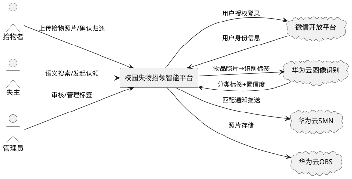
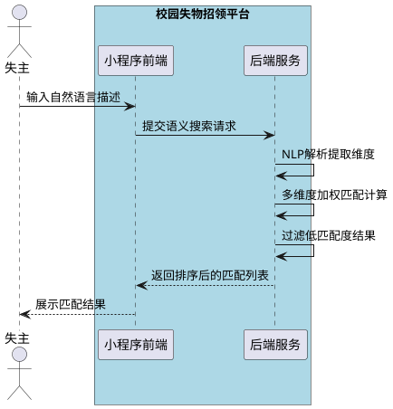
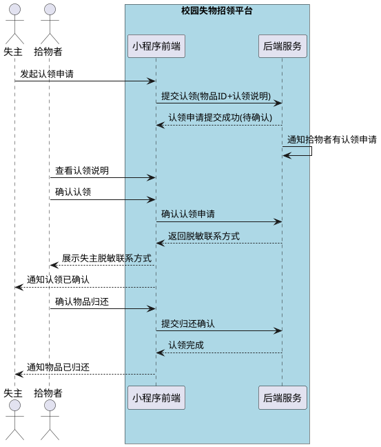

# **1. 组件定位**

## **1.1 核心职责**

本组件负责管理校园失物招领全流程，实现拾物上报、智能识别、语义搜索、自动匹配与认领归还闭环。

## **1.2 核心输入**

1. 拾到物品者上传的物品照片及描述信息
2. 失主提交的自然语言搜索描述（如"上周在图书馆丢了一把蓝色雨伞"）
3. 认领申请及身份验证信息
4. 归还确认操作指令
5. 微信小程序用户登录授权信息

## **1.3 核心输出**

1. 物品识别标签与分类结果（AI图像识别输出）
2. 匹配物品列表与排序结果
3. 匹配成功通知推送（华为云SMN消息推送）
4. 联系方式（加密脱敏后）
5. 认领流程状态变更通知
6. 归还确认凭证

## **1.4 职责边界**

1. 不负责用户账号系统的底层实现（依赖微信开放平台授权）
2. 不负责图像识别模型的训练与维护（接入华为云图像识别服务）
3. 不负责线下物品的实际交付与物流
4. 不负责支付结算功能

# **2. 领域术语**

**失物**
: 失主丢失的物品，包含物品描述、丢失地点、丢失时间等信息。

**拾物**
: 拾到物品者上报的物品，包含照片、拾到地点、拾到时间、AI识别标签等信息。

**物品标签**
: 由AI图像识别自动生成的物品分类标签，如"雨伞""钱包""钥匙"等。

**匹配度**
: 失物描述与拾物信息之间的语义相似度评分，取值范围0~1。

**认领申请**
: 失主对匹配拾物发起的认领请求，需经过验证流程。

**联系方式加密**
: 对用户手机号等联系方式进行AES加密存储，展示时脱敏处理。

**归还确认**
: 拾物者确认物品已归还失主的闭环操作，完成认领流程。

**语义搜索**
: 失主使用自然语言描述失物特征的搜索方式，系统自动提取时间、地点、物品类别等维度进行匹配。

# **3. 角色与边界**

## **3.1 核心角色**

- **拾物者**：拾到物品并拍照上传的用户，负责上报拾物信息、确认归还
- **失主**：丢失物品的用户，负责语义搜索、发起认领申请、确认收到物品
- **管理员**：平台运营人员，负责审核异常认领、管理物品分类标签

## **3.2 外部系统**

- **微信开放平台**：提供小程序用户登录授权与身份信息
- **华为云图像识别服务**：对上传照片进行物品类别识别与标签生成
- **华为云SMN消息推送**：物品匹配成功时向失主推送通知
- **华为云OBS对象存储**：存储物品照片等文件资源

## **3.3 交互上下文**



# **4. DFX约束**

## **4.1 性能**

1. 物品上报接口响应时间必须 ≤ 2秒（不含图像识别耗时）
2. 语义搜索接口响应时间必须 ≤ 3秒
3. 图像识别端到端耗时必须 ≤ 5秒
4. 系统并发支持必须 ≥ 500 QPS

## **4.2 可靠性**

1. 系统可用性目标必须 ≥ 99.9%
2. 物品数据不允许丢失，必须持久化存储
3. 匹配通知推送失败时必须重试，最多重试3次
4. 图像识别服务不可用时，必须降级为手动选择分类

## **4.3 安全性**

1. 所有接口必须通过JWT Token认证
2. 联系方式必须使用AES-256加密存储
3. 联系方式展示时必须脱敏（手机号中间4位用*替代）
4. 认领流程中禁止直接暴露对方完整联系方式，必须经平台中转
5. 上传照片必须经过安全扫描，禁止上传恶意文件

## **4.4 可维护性**

1. 关键业务操作必须记录审计日志（上报、认领、归还确认）
2. 必须提供物品匹配成功率监控指标
3. 必须提供图像识别服务调用成功率与延迟监控

## **4.5 兼容性**

1. 微信小程序基础库版本必须 ≥ 2.20.0
2. 后端API版本必须遵循语义化版本规范，v1接口必须向后兼容

# **5. 核心能力**

## **5.1 拾物上报与AI识别**

### **5.1.1 业务规则**

1. **照片上传规则**：拾物者上传照片时，必须支持jpg/png格式，单张照片大小必须 ≤ 10MB，每次上报必须上传至少1张、最多5张照片

   a. 验收条件：[上传6张照片] → [提示最多5张并拒绝第6张]

2. **物品信息填写规则**：上报时必须填写拾到地点、拾到时间，物品描述为可选项（AI识别结果可自动填充）

   a. 验收条件：[未填写拾到地点直接提交] → [提示地点为必填项]

3. **AI图像识别规则**：照片上传后，系统必须调用华为云图像识别服务，自动生成物品类别标签与置信度；置信度 ≥ 0.7时自动采纳标签，< 0.7时标记为"待确认"并提示用户手动选择

   a. 验收条件：[上传雨伞照片，置信度0.85] → [自动标签为"雨伞"]
   b. 验收条件：[上传模糊照片，置信度0.5] → [标签标记为"待确认"]

4. **物品状态规则**：新上报的拾物状态必须为"待认领"，30天无人认领自动变更为"已过期"

   a. 验收条件：[拾物上报30天无认领申请] → [状态自动变更为"已过期"]

5. **禁止项**：禁止上报违禁物品，系统必须对识别结果进行违禁品过滤

   a. 验收条件：[上传刀具照片] → [拒绝上报并提示违禁品]

### **5.1.2 交互流程**

```plantuml
@startuml
actor "拾物者" as finder
box "校园失物招领平台" #LightBlue
participant "小程序前端" as fe
participant "后端服务" as be
end box
cloud "华为云图像识别" as ai
cloud "华为云OBS" as obs

finder -> fe : 拍照/选择照片
fe -> be : 上传照片
be -> obs : 存储照片
obs --> be : 返回照片URL
be -> ai : 请求图像识别
ai --> be : 返回类别标签+置信度
be --> fe : 返回识别结果
fe --> finder : 展示识别标签(可修改)
finder -> fe : 确认并提交拾物信息
fe -> be : 提交拾物上报(地点/时间/标签)
be --> fe : 上报成功
@enduml
```

### **5.1.3 异常场景**

1. **图像识别服务不可用**

   a. 触发条件：华为云图像识别服务返回错误或超时
   b. 系统行为：降级为手动选择分类模式，记录识别服务异常日志
   c. 用户感知：提示"AI识别暂不可用，请手动选择物品类别"

2. **照片格式不支持**

   a. 触发条件：上传非jpg/png格式文件
   b. 系统行为：拒绝上传请求
   c. 用户感知：提示"仅支持jpg/png格式照片"

3. **照片大小超限**

   a. 触发条件：单张照片超过10MB
   b. 系统行为：拒绝上传请求
   c. 用户感知：提示"照片大小不能超过10MB"

## **5.2 语义搜索与智能匹配**

### **5.2.1 业务规则**

1. **自然语言解析规则**：系统必须从失主的自然语言描述中提取时间、地点、物品类别、颜色、品牌等维度信息

   a. 验收条件：[输入"上周在图书馆丢了一把蓝色雨伞"] → [提取：时间=上周、地点=图书馆、类别=雨伞、颜色=蓝色]

2. **多维度匹配规则**：系统必须对每个提取维度进行独立匹配并加权计算综合匹配度；权重分配为：类别0.4、地点0.3、时间0.2、颜色/品牌0.1

   a. 验收条件：[失物搜索"蓝色雨伞"匹配到"蓝色雨伞"和"黑色雨伞"] → [蓝色雨伞匹配度更高]

3. **结果排序规则**：匹配结果必须按匹配度降序排列，匹配度 < 0.3的记录必须过滤不展示

   a. 验收条件：[搜索结果中所有物品匹配度均 < 0.3] → [提示"未找到匹配物品"]

4. **搜索结果展示规则**：每条结果必须展示物品照片缩略图、类别标签、拾到地点、拾到时间、匹配度

   a. 验收条件：[查看搜索结果列表] → [每条记录包含照片、标签、地点、时间、匹配度]

### **5.2.2 交互流程**



### **5.2.3 异常场景**

1. **搜索描述为空**

   a. 触发条件：失主提交空搜索描述
   b. 系统行为：拒绝搜索请求
   c. 用户感知：提示"请输入失物描述"

2. **NLP解析失败**

   a. 触发条件：自然语言描述过于模糊无法提取有效维度
   b. 系统行为：返回最近30天全部拾物列表，按时间倒序排列
   c. 用户感知：提示"描述较模糊，已展示近期所有拾物信息"

## **5.3 匹配通知推送**

### **5.3.1 业务规则**

1. **自动推送规则**：当新上报拾物与已有失物记录的匹配度 ≥ 0.6时，系统必须自动向失主推送匹配通知

   a. 验收条件：[新拾物"蓝色雨伞"与失主登记的"蓝色雨伞"匹配度0.75] → [自动推送通知给失主]

2. **通知内容规则**：通知必须包含物品类别、拾到地点、拾到时间、匹配度，禁止包含拾物者联系方式

   a. 验收条件：[收到匹配通知] → [包含类别/地点/时间/匹配度，不含联系方式]

3. **推送渠道规则**：必须通过华为云SMN消息推送服务发送，支持微信服务通知模板消息

   a. 验收条件：[触发匹配推送] → [通过华为云SMN发送微信模板消息]

4. **推送失败重试规则**：推送失败时必须间隔5秒重试，最多重试3次；3次均失败时记录异常日志

   a. 验收条件：[SMN服务第1次推送失败] → [5秒后重试，最多3次]

### **5.3.2 交互流程**

```plantuml
@startuml
box "校园失物招领平台" #LightBlue
participant "后端服务" as be
end box
cloud "华为云SMN" as smn
actor "失主" as owner

be -> be : 新拾物上报触发匹配计算
be -> be : 发现匹配度≥0.6的失物记录
be -> smn : 发送匹配通知
smn --> owner : 微信服务通知
alt 推送失败
    be -> smn : 5秒后重试(最多3次)
end
@enduml
```

### **5.3.3 异常场景**

1. **SMN服务不可用**

   a. 触发条件：华为云SMN服务连续3次推送失败
   b. 系统行为：记录推送异常日志，通知进入待推送队列，定时任务补推
   c. 用户感知：通知延迟送达

## **5.4 认领流程与归还确认**

### **5.4.1 业务规则**

1. **认领申请规则**：失主必须对目标拾物发起认领申请，填写认领说明（物品特征描述以验证身份）

   a. 验收条件：[认领申请未填写认领说明] → [提示"请填写认领说明以验证身份"]

2. **联系方式中转规则**：认领申请通过后，系统必须提供平台内聊天中转或脱敏联系方式，禁止直接暴露完整手机号

   a. 验收条件：[认领通过后查看联系方式] → [手机号显示为138****5678格式]

3. **认领状态流转规则**：认领状态必须按"待确认→已确认→归还中→已完成"流转，拾物者确认认领后状态变更为"已确认"

   a. 验收条件：[拾物者确认认领申请] → [认领状态变更为"已确认"]

4. **归还确认规则**：拾物者必须确认物品已归还，确认后认领状态变更为"已完成"，拾物状态变更为"已归还"

   a. 验收条件：[拾物者点击"确认归还"] → [认领状态="已完成"，拾物状态="已归还"]

5. **认领冲突规则**：同一拾物同时只能有一个有效认领申请；已有"待确认"认领时，其他认领申请必须排队等待

   a. 验收条件：[拾物已有待确认认领，另一失主申请认领] → [提示"该物品正在认领中，请稍后重试"]

6. **禁止项**：禁止恶意认领，同一用户24小时内认领申请超过5次必须触发风控拦截

   a. 验收条件：[用户24小时内发起第6次认领] → [触发风控，提示"操作频繁，请明日再试"]

### **5.4.2 交互流程**



### **5.4.3 异常场景**

1. **认领说明与物品特征不符**

   a. 触发条件：拾物者判断认领说明无法证明失主身份
   b. 系统行为：拾物者可拒绝认领申请
   c. 用户感知：失主收到"认领被拒绝"通知

2. **认领超时未确认**

   a. 触发条件：认领申请提交后48小时拾物者未确认
   b. 系统行为：自动取消该认领申请，释放排队中的下一个认领
   c. 用户感知：失主收到"认领超时已取消"通知

3. **风控拦截**

   a. 触发条件：用户24小时内认领申请超过5次
   b. 系统行为：拦截认领请求并记录风控日志
   c. 用户感知：提示"操作频繁，请明日再试"

# **6. 数据约束**

## **6.1 拾物记录**

1. **id**：全局唯一标识，UUID格式
2. **finderId**：拾物者用户ID，必填
3. **category**：物品类别标签，由AI识别或手动选择，必填
4. **confidence**：AI识别置信度，取值0~1，可为空（手动选择时）
5. **description**：物品文字描述，选填
6. **location**：拾到地点，必填，最大100字符
7. **foundTime**：拾到时间，必填，不能晚于当前时间
8. **photos**：照片URL列表，至少1张最多5张
9. **status**：状态枚举，取值范围：待认领/认领中/已归还/已过期
10. **createdAt**：创建时间，系统自动生成
11. **updatedAt**：更新时间，系统自动生成

## **6.2 失物搜索记录**

1. **id**：全局唯一标识，UUID格式
2. **ownerId**：失主用户ID，必填
3. **searchText**：原始搜索文本，必填
4. **parsedDimensions**：NLP解析后的维度信息（时间/地点/类别/颜色/品牌），JSON格式
5. **createdAt**：创建时间，系统自动生成

## **6.3 认领记录**

1. **id**：全局唯一标识，UUID格式
2. **itemId**：关联拾物ID，必填
3. **claimerId**：认领者（失主）用户ID，必填
4. **claimReason**：认领说明，必填，最大500字符
5. **status**：状态枚举，取值范围：待确认/已确认/归还中/已完成/已拒绝/已超时
6. **confirmedAt**：拾物者确认时间，确认时系统自动填充
7. **returnedAt**：归还确认时间，确认时系统自动填充
8. **createdAt**：创建时间，系统自动生成

## **6.4 用户信息**

1. **userId**：微信OpenID，全局唯一，必填
2. **nickname**：微信昵称，必填
3. **avatarUrl**：微信头像URL，必填
4. **phoneEncrypted**：加密后的手机号，AES-256加密存储，必填
5. **campus**：所属校区，选填
6. **createdAt**：注册时间，系统自动生成